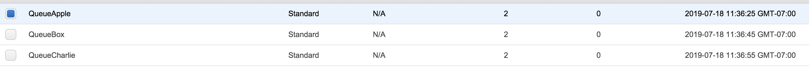
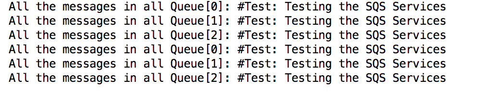

# SQS_messageQueues
> Implement a few Message Queues and Broadcasters and wiring them through code.

## Feature Task
> Create 3 Standard Queues:
  * QueueA
  * QueueB
  * QueueC
  
> Create command line applications in Java that use these queues
  * Queue Publisher : Sends a message to a queue, using its ARN or URL
  * Queue Client : Receives messages from a Queue (by ARN) and displays them
  
## Available Funtionality

> SQSReciver: Class to import all message in the SQS and displays all the messages in three queues
> SQSSender: Class to send all messages to all the three SQS

## Steps:
> Create gradle application : gradle init --type java-library

> Add proper (as indicated in trouble shoot steps) dependencies

> Create a Sender and Receiver class to send/recived messages to Queue.

> Upon running the sender class SQS console should be updated with the numbers of messsages been sent


> Upon running the receiver locale console should be display all the messages



## References 

> https://docs.aws.amazon.com/AWSSimpleQueueService/latest/SQSDeveloperGuide/prerequisites.html

> https://github.com/awsdocs/aws-doc-sdk-examples

## Trouble Shoot Step
> Add: compile 'com.amazonaws:aws-java-sdk-sqs:1.11.587' to the build.gradle

> Import following on your classes:
 * import com.amazonaws.services.sqs.AmazonSQS;
 * import com.amazonaws.services.sqs.AmazonSQSClientBuilder;
 * import com.amazonaws.services.sqs.model.AmazonSQSException;
 * import com.amazonaws.services.sqs.model.CreateQueueResult;
 * import com.amazonaws.services.sqs.model.Message;
 * import com.amazonaws.services.sqs.model.SendMessageBatchRequest;
 * import com.amazonaws.services.sqs.model.SendMessageBatchRequestEntry;
 * import com.amazonaws.services.sqs.model.SendMessageRequest;

> To get environment variables in gradle application: System.getenv(_Name-OF-SQS-URL) 

> ```nano ~/.aws/config``` to resolve the AWS related warnings  
## Deployed Links
> None
